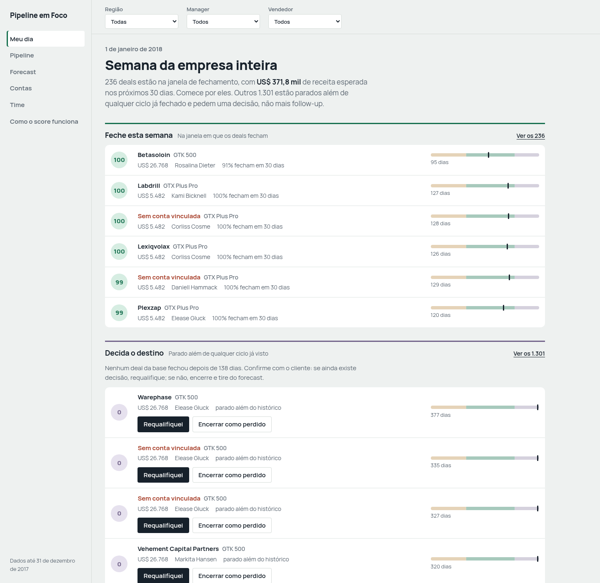
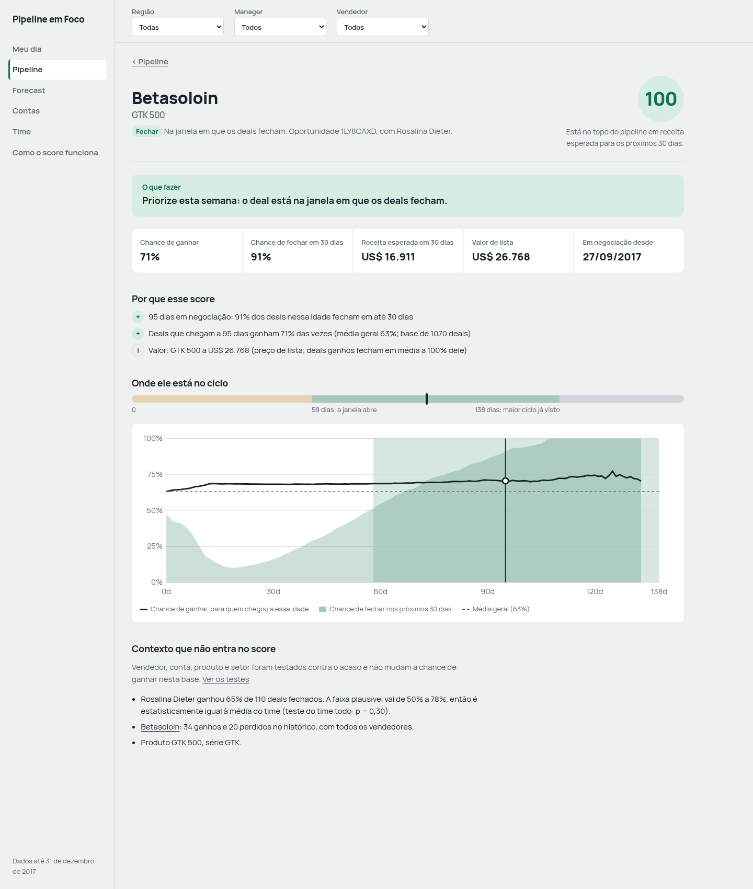
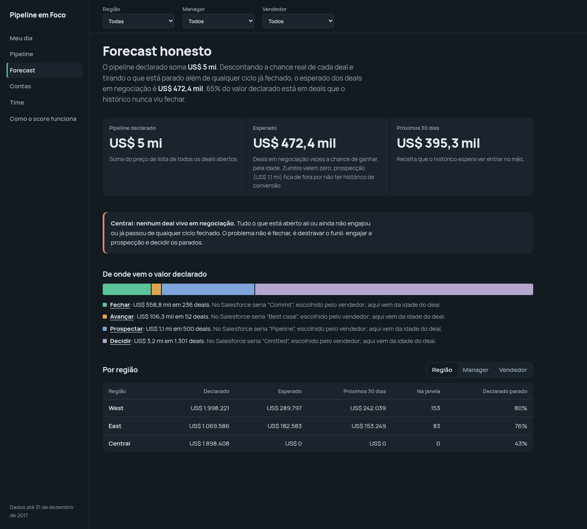

# Submissão — [SEU NOME] — Challenge 003

## Sobre mim

- **Nome:** [SEU NOME]
- **LinkedIn:** [LINK]
- **Challenge escolhido:** 003 — Lead Scorer

---

## Executive Summary

Construí o **Pipeline em Foco**, um app de vendas (React + motor de scoring em Python) que diz a cada vendedor onde focar na segunda de manhã, com o porquê de cada prioridade em português claro, e um bot que manda essa mesma fila por Slack ou email sem precisar abrir o app. Antes de pontuar qualquer coisa, testei cada feature contra o acaso: **vendedor, conta, produto, setor, região e manager não mudam a chance de ganhar nesta base** (p entre 0,22 e 0,99). O único sinal real é a **idade do deal**. É ela que define o score e as filas de ação. O achado que muda a conversa com a Head de RevOps: **65% do pipeline declarado (US$ 3,2 mi de US$ 5,0 mi) está em deals parados além de qualquer ciclo já fechado**, e a região **Central não tem nenhum deal vivo em negociação**.

**App publicado:** [URL DO GITHUB PAGES]

---

## Solução

### O que o vendedor vê

| Tela | Pergunta que responde | Inspiração (Salesforce) e o que mudei |
|---|---|---|
| **Meu dia** | "Em que eu trabalho esta semana?" | Home + Einstein Deal Insights, mas organizado em 4 filas com verbo: **feche**, **decida**, **mantenha em movimento**, **engaje** |
| **Pipeline** | "Como está tudo?" | List view + Kanban. Ordenado por receita esperada, com a régua de idade em cada linha |
| **Ficha do deal** | "Por que esse score?" | Einstein Opportunity Scoring. Só entram fatores que passaram no teste estatístico; o resto aparece como "contexto que não entra no score" |
| **Forecast honesto** | "Quanto vai entrar de verdade?" | Forecast categories. A categoria vem da idade do deal, não da opinião do vendedor. Mostra declarado × esperado × próximos 30 dias e alerta de funil travado |
| **Contas** | "Qual o histórico com esse cliente?" | Account page, com holding (`subsidiary_of`) |
| **Time** | "Alguém precisa de ajuda?" | Performance dashboard, mas **sem ranking injusto**: taxa com intervalo de confiança corrigido e foco em higiene de pipeline |
| **Como o score funciona** | "Posso confiar?" | Model card: curva, testes, correções nos dados, limitações |

Filtros de **região → manager → vendedor** em todas as telas. Com um vendedor selecionado, a tela vira "Bom dia, Hayden."





### Setup

**Só ver:** abra [URL DO GITHUB PAGES].

**Rodar local** (Node 22+):
```bash
cd submissions/hisdevotions-afk/solution/app
npm install
npm run dev          # abre em http://localhost:5173
```
O `data.json` com os scores já está versionado em `app/public/`, então não precisa de Python para ver o app.

**Recalcular os scores** (Python 3.12+, nenhuma dependência):
```bash
cd submissions/hisdevotions-afk/solution/engine
python3 scoring.py                    # lê ../data/*.csv e grava ../app/public/data.json
python3 scoring.py --ref 2017-11-30   # simula outro "hoje"
python3 test_scoring.py               # testes do motor (ou: python3 -m pytest)
```

**Bot de notificação** (mesma pasta `engine/`, lê o `data.json` já gerado — sem LLM, sem texto novo, só reformata as filas e ações que o app mostra em "Meu dia"):
```bash
python3 notify.py --agent "Hayden Neloms"                       # imprime a fila do vendedor no terminal
python3 notify.py --agent "Hayden Neloms" --webhook $SLACK_URL  # manda pro Slack (incoming webhook)
python3 notify.py --agent "Hayden Neloms" --to time@empresa.com # manda por email (precisa de SMTP_HOST no ambiente)
python3 notify.py                                                # digest da empresa inteira, uma mensagem só

python3 notify.py --all                                          # um digest por vendedor dos 35, impresso (sem destino)
python3 notify.py --all --targets targets.json                   # ...mandado pro destino de cada um (ver targets.example.json)
python3 test_notify.py                                           # testes do bot (ou: python3 -m pytest)
```
Sem `--webhook`/`--to`, o bot só imprime — dá pra testar sem credencial nenhuma. `sales_teams.csv` não tem email nem Slack ID de ninguém, então não existe como descobrir o destino de cada vendedor a partir do dataset: `--targets targets.json` é o diretório vendedor→destino que a RevOps manteria (em produção viria do SSO/diretório da empresa). Sem esse arquivo, `--all` cai no mesmo modo seguro do modo single — imprime os 35, não envia nada; quem não estiver no arquivo também cai nesse modo (ou no `--webhook`/`--to` global, se algum foi passado). Em produção, um cron diário rodaria `scoring.py` e depois `notify.py --all --targets targets.json`.

Saída real de `python3 notify.py --agent "Hayden Neloms"` (dados de 31/12/2017):
```
Bom dia, Hayden.

*Feche esta semana* (5)
  - Konmatfix — GTX Plus Pro — US$ 721 em 30d: Priorize esta semana: o deal está na janela em que os deals fecham.
  - Sem conta vinculada — MG Advanced — US$ 604 em 30d: Priorize esta semana: o deal está na janela em que os deals fecham.
  ...

*Decida o destino* (44)
  - Sem conta vinculada — GTX Plus Pro — US$ 5.482 parado: Requalifique ou encerre: confirme com o cliente se ainda existe decisão; se não, marque como perdido.
  ...

*Mantenha em movimento* (1)
  - Silis — MG Special — US$ 37 esperado: Mantenha contato e avance: faltam ~33 dias para a janela de fechamento.

*Engaje* (0)
  (nenhum deal)

36 deal(s) sem conta vinculada — cadastre a empresa no CRM.
```

### Lógica do scoring

**1. Olhar os dados antes de escolher features.** Testei cada característica com uma simulação: se todos os grupos tivessem a mesma chance de ganhar (63%), com que frequência o acaso produziria diferenças tão grandes quanto as reais?

| Característica | p vs. acaso | No score? |
|---|---|---|
| **Idade do deal** | **< 0,001** | **Sim** |
| Mês de fim de trimestre | < 0,001 | Não: indica quando o deal é registrado, não se um deal aberto vai fechar |
| Vendedor | 0,30 | Não |
| Vendedor × produto | 0,22 | Não |
| Produto | 0,48 | Não |
| Região / Manager | 0,78 / 0,88 | Não |
| Conta / Setor | 0,95 / 0,99 | Não |

**2. O que a idade ensina** (aprendido dos 6.711 deals fechados **e** dos deals ainda abertos, que também são evidência — um deal aberto há 90 dias que não fechou prova que 90 dias não garante fechar em 30, e isso tem que contar no cálculo, não só quem já fechou):
- Deals que morrem, morrem cedo: fechados em até 15 dias ganham só 56%. Os que sobrevivem ganham de 68% a 83%.
- A chance de fechar nos próximos 30 dias sobe depois disso, atinge o pico por volta dos **75 dias** (44%) e cai de novo conforme o deal envelhece — não é um degrau que fica alto para sempre.
- A **janela de fechamento** (44 a 138 dias) é onde essa chance está em pelo menos metade do seu pico.
- **Nenhum deal fechou depois de 138 dias.** Acima disso não há histórico: o deal é um **zumbi**.

Os limites (44, 75 e 138) são calculados a partir dos dados, não escolhidos por mim. Com outra base, eles se ajustam sozinhos.

**3. O score.** `score = P(ganhar nos próximos 30 dias | idade)`, em pontos percentuais — um score de 31 quer dizer 31% de chance, não uma posição no ranking do pipeline. Não depende do valor do deal: um deal de US$ 500 e um de US$ 50 mil na mesma idade têm o mesmo score. Zumbi e prospecção ficam **sem score** (não têm histórico confiável de curto prazo); a fila continua ordenada por receita esperada (valor × chance), que é uma conta diferente do score. A chance é suavizada em direção à média quando há pouca amostra (prior de 20 deals).

**4. A explicação.** Cada deal traz os motivos gerados a partir dos números, por exemplo *"75 dias em negociação: 44% dos deals nessa idade fecham em até 30 dias"*, e uma ação recomendada. O texto é determinístico, sem LLM em runtime: zero alucinação no que o vendedor lê e zero chave de API para rodar.

**5. Correções nos dados:** `GTXPro` → `GTX Pro` (1.480 deals perdiam o preço no join), `technolgy` → `technology`.

### Recomendações para a Head de RevOps

1. **Limpar o forecast esta semana.** 1.301 deals (US$ 3,2 mi) estão além de qualquer ciclo já fechado. Cada vendedor decide os seus pela fila "Decidir": requalifica ou encerra.
2. **Olhar a Central.** A região tem zero deals vivos em negociação: 408 parados e todos os 500 deals em prospecção. O trabalho ali não é fechar, é engajar.
3. **Parar de ranquear vendedores por taxa de ganho.** Com estes dados, as diferenças são ruído (p = 0,30). Cobre higiene: parados, sem conta.
4. **Registrar atividade no CRM** (e-mail, reunião). Hoje a idade é o único sinal. Com atividade, o score passa a enxergar o deal velho com reunião marcada amanhã.

### Limitações

- **O CRM não tem atividade.** Idade é o melhor sinal disponível, não o ideal. Um deal com 150 dias e reunião amanhã aparece como zumbi.
- **Retrato de 31/12/2017.** Em produção, o motor rodaria toda noite sobre o CRM, e as decisões ("encerrar", "requalifiquei") gravariam de volta nele. Hoje ficam no `localStorage` do navegador.
- **Prospecção sem histórico de conversão.** Não se sabe quantos prospects chegam a engajar, então a prospecção fica fora do forecast esperado.
- **Viés de sobrevivência no limite dos 138 dias.** A curva de chance-de-fechar-logo já conta os deals abertos que sobreviveram a uma idade sem fechar (não só quem já fechou), mas o próprio teto de 138 dias vem só de deals fechados, e o dataset termina em 31/12/2017: um deal aberto há 150 dias pode ter um destino que a base ainda não teve tempo de registrar. Por isso a ação em "Decidir" é requalificar ou encerrar, não descartar sozinho.
- **O bot de notificação não sabe o email/canal de cada vendedor por conta própria.** `sales_teams.csv` não tem esse dado. `notify.py --all --targets targets.json` resolve isso mantendo o diretório num arquivo à parte (ver `targets.example.json`), mas esse arquivo é meu, não do dataset — alguém da RevOps precisaria mantê-lo atualizado à mão. Em produção, isso viria do diretório da empresa (SSO, Slack user ID por `sales_agent`), não de um JSON solto.
- **Para escalar:** o motor lê CSV; trocar `load()` por uma query no CRM é a única mudança. Se a base crescer 100×, a curva precisa de um algoritmo O(n log n) (anotado no código). Com dados de atividade, dá para adicionar features e rodar os mesmos testes de significância antes de aceitá-las.

---

## Process Log — Como usei IA

> O registro completo, cronológico e com os erros, está em [`process-log/PROCESS.md`](process-log/PROCESS.md). O histórico de commits da branch mostra a evolução.

### Ferramentas usadas

| Ferramenta | Para que usei |
|---|---|
| Claude Code (Claude Opus 5.5) | Exploração dos dados, testes estatísticos, motor de scoring, app React, revisão visual, git |
| Chrome headless | Screenshots de verificação de todas as telas (claro, escuro, mobile) |
| Memória persistente do Claude Code | Guardar o brief do desafio como referência primária para toda decisão |

### Workflow

1. Pedi à IA para ler os 4 desafios e **varrer meus projetos locais** atrás de algo reaproveitável. Ela achou no meu CRM de produção (rede de escolas) heurísticas de pipeline que eu já opero: estado "morto", comparação com pares com amostra mínima, fila por valor esperado. Levei o raciocínio, não o código.
2. **Exploração antes de qualquer feature.** O teste contra o acaso derrubou quase todas as features "óbvias".
3. Desenho: a IA propôs uma tela única. **Eu corrigi**: a tela matinal é uma feature; o produto é um app de vendas no nível do Salesforce, refinado. Também **questionei** a stack, e saímos de "SPA simples" para React + TS.
4. Motor com testes → app → revisão com screenshots → correções → teste funcional no navegador.

### Onde a IA errou e como corrigi

| Erro | Como apareceu | Correção |
|---|---|---|
| Sugeriu "esse vendedor fecha 40% menos que os pares" como diferencial | Teste de significância: p = 0,22 | Nenhuma feature entra no score sem passar no teste |
| Rotulou 2 vendedores como acima/abaixo da média | Revisão da saída: 35 comparações a 95% geram 1–2 falsos positivos | Correção de Bonferroni + teste que impede rótulo sem sinal |
| Score comprimido entre 62 e 100 | Screenshot: 6 deals com 100 no topo | Percentil só entre deals vivos + teste |
| Forecast contava prospecção a 63% | Revisão do forecast | Prospecção fora do esperado (US$ 1,2 mi → US$ 472 mil) |
| Bug de mutação de datas; `git add -f` incluiu `node_modules` | Teste ponta a ponta; revisão do commit | Corrigidos antes de qualquer push |
| Curva "% fecham em 30 dias" ignorava deals abertos que nunca fecharam (contava só quem já fechou) | Revisão externa (Claude Code, sessão de auditoria): um deal aberto há 90 dias sem fechar é prova de que 90 dias não garante fechar — e não entrava na conta | Denominador passou a incluir os abertos observados pela janela inteira sem fechar; a janela de 58 dias/">=50%" (que não existia mais depois da correção) virou "pico dos 75 dias, limite em metade do pico" |
| Score = percentil da receita esperada: correlação de 0,90 com o preço, quase um "ordenar por valor" | Mesma auditoria | Score virou a chance de ganhar em 30 dias (não depende do preço); prioridade da fila continua sendo receita esperada, mas é um número separado |

### O que eu adicionei que a IA sozinha não faria

- **Contexto de operação real.** O conceito de deal "morto" que vira decisão, e não alerta eterno, vem do meu CRM em produção.
- **Escopo de produto.** A IA começou com uma tela; eu puxei para um app de vendas completo, com o padrão "pegar o melhor do Salesforce e refinar" que já uso.
- **Desconfiança do output.** Cada número foi conferido na tela antes de ir para o README. Três dos erros acima só apareceram porque revisei a saída em vez de aceitar "os testes passaram".

---

## Evidências

- [x] Process log detalhado: [`process-log/PROCESS.md`](process-log/PROCESS.md)
- [x] Screenshots de verificação: [`process-log/screenshots/`](process-log/screenshots/)
- [x] Git history: commits da branch `submission/hisdevotions-afk`
- [ ] Chat export da sessão do Claude Code: [adicionar]

---

_Submissão enviada em: [data]_
