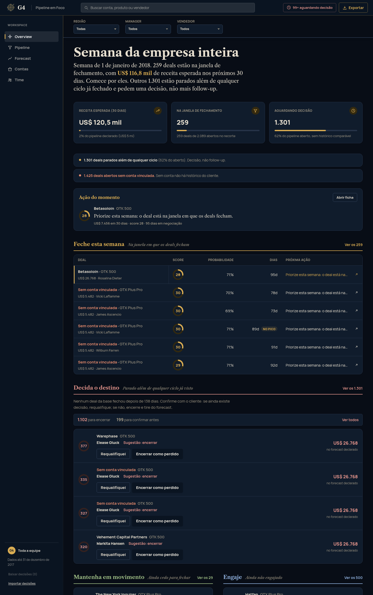
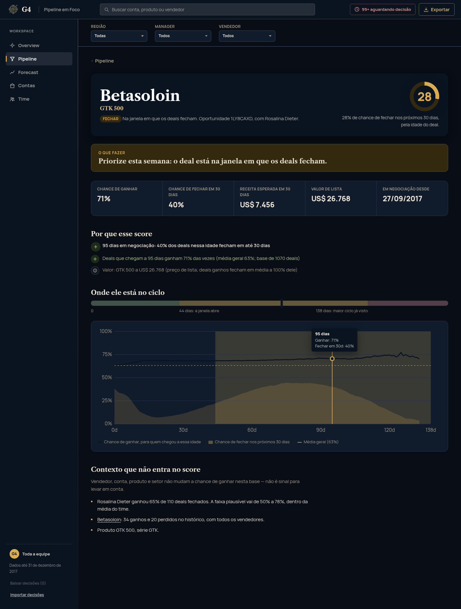
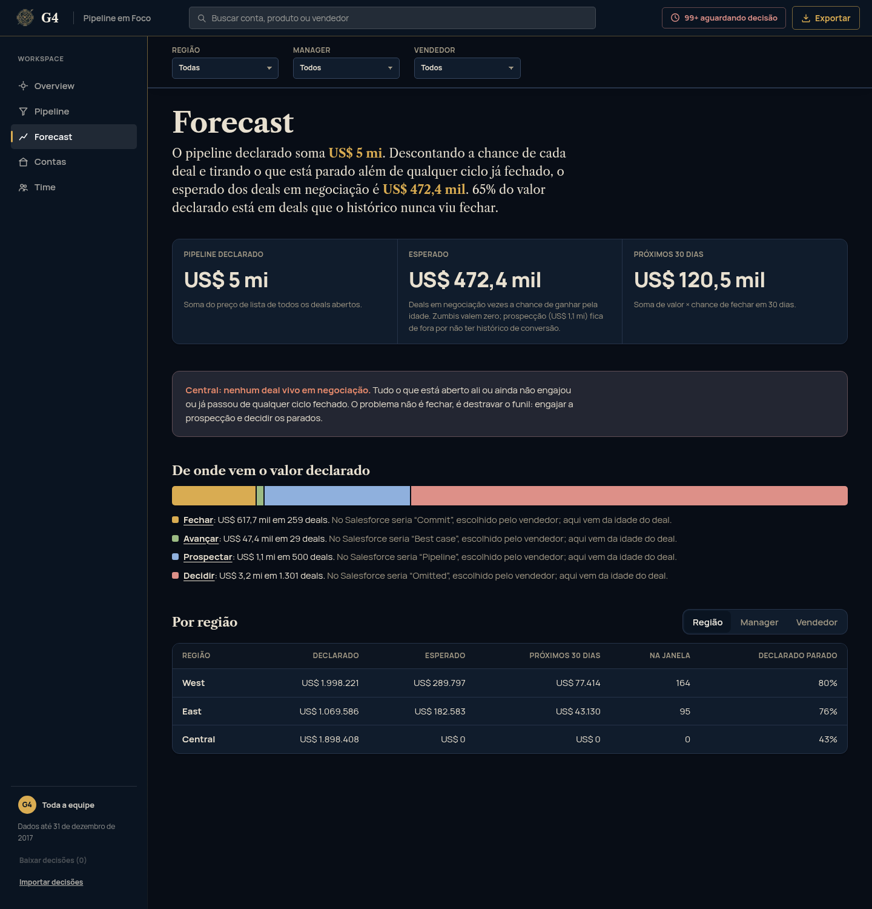

# Submissão — [SEU NOME] — Challenge 003

## Sobre mim

- **Nome:** [SEU NOME]
- **LinkedIn:** [LINK]
- **Challenge escolhido:** 003 (Lead Scorer)

---

## Executive Summary

Construí o Pipeline em Foco, um app de vendas em React com um motor de scoring em Python. Na segunda de manhã ele mostra a cada vendedor em que deals trabalhar e explica em português por que cada um está ali. Um bot manda a mesma fila por Slack ou email para quem não quiser abrir o app. Antes de pontuar qualquer coisa, testei cada característica do CRM contra o acaso: vendedor, conta, tamanho da conta, produto, setor, região e manager não mudam a chance de ganhar nesta base (p entre 0,22 e 0,99). O único sinal que passou foi a idade do deal, e é ela que define o score e as filas de ação. O achado que mais importa para a Head de RevOps é que 65% do pipeline declarado (US$ 3,2 mi de US$ 5,0 mi) está em deals parados além do maior ciclo que a base já fechou, e que a região Central não tem nenhum deal vivo em negociação.

App publicado: [URL DO GITHUB PAGES]

---

## Solução

### Abordagem

Comecei pelos dados. Antes de escolher qualquer feature, testei cada característica do pipeline com uma simulação de acaso e só deixei entrar no score o que passou no teste. Sobrou a idade do deal. Em cima disso desenhei o app, usando o Salesforce como referência de telas e cortando o que não tinha dado por trás.

O motor roda em Python sem nenhuma dependência e grava um `data.json` que o app lê. Não há LLM em tempo de execução: todo texto que o vendedor lê é montado a partir dos números, então sempre bate com o dado.

### O que o vendedor vê

| Tela | Pergunta que responde | Referência no Salesforce e o que mudou |
|---|---|---|
| Overview | "Em que eu trabalho esta semana?" | Home com Einstein Deal Insights. Aqui ela vira quatro filas com verbo (feche, decida, mantenha em movimento, engaje), um card com a ação do momento e a fila "Feche esta semana" em tabela, com score, probabilidade, dias e próxima ação |
| Pipeline | "Como está tudo?" | List view e Kanban, ordenados por receita esperada, com a régua de idade em cada linha. Na fila Decidir dá para selecionar vários deals e decidir em lote, com confirmação e desfazer |
| Ficha do deal | "Por que esse score?" | Einstein Opportunity Scoring. Só aparecem como motivo os fatores que passaram no teste estatístico; o resto fica em "contexto que não entra no score" |
| Forecast | "Quanto vai entrar, descontada a chance de cada deal?" | Forecast categories, com a categoria vindo da idade do deal em vez da opinião do vendedor. Mostra declarado, esperado e próximos 30 dias, e avisa quando um grupo está com o funil travado |
| Contas | "Qual o histórico com esse cliente?" | Account page, com o grupo empresarial (`subsidiary_of`) |
| Time | "Alguém precisa de ajuda?" | Performance dashboard sem ranking: taxa de ganho com intervalo de confiança corrigido e a contagem de problemas de pipeline de cada pessoa |

O score aparece dentro de um anel que preenche até o próprio valor: um deal com score 28 tem o anel preenchido em 28%.

Havia uma sétima tela, "Como o score funciona", com a curva e a tabela de significância. Tirei do produto porque explicar como o modelo foi construído é trabalho da documentação. Essa parte de auditoria (teste contra o acaso, correções nos dados, limitações) está aqui no README e em `process-log/PROCESS.md`. Dentro do app ficou o que ajuda a decidir, cada coisa junto do dado a que se refere: o motivo do score, a taxa do vendedor com a faixa de confiança e o histórico da conta.

Todas as telas têm filtro de região, manager e vendedor, em cascata. Com um vendedor selecionado, a Overview abre com "Bom dia, Hayden."





A lista do Pipeline está em [`15-pipeline.png`](process-log/screenshots/15-pipeline.png) e a Overview num celular de 390 px em [`16-mobile.png`](process-log/screenshots/16-mobile.png).

### Setup

Para só ver, abra [URL DO GITHUB PAGES].

Para rodar local (Node 22+):
```bash
cd submissions/hisdevotions-afk/solution/app
npm install
npm run dev          # abre em http://localhost:5173
```
O `data.json` com os scores já está versionado em `app/public/`, então não precisa de Python para ver o app.

Para recalcular os scores (Python 3.12+, nenhuma dependência):
```bash
cd submissions/hisdevotions-afk/solution/engine
python3 scoring.py                    # lê ../data/*.csv e grava ../app/public/data.json
python3 scoring.py --ref 2017-11-30   # simula outro "hoje"
python3 test_scoring.py               # testes do motor (ou: python3 -m pytest)
```

O bot de notificação fica na mesma pasta `engine/`. Ele lê o `data.json` já gerado e reformata as filas e ações que o app mostra na Overview, sem LLM e sem texto novo:
```bash
python3 notify.py --agent "Hayden Neloms"                       # imprime a fila do vendedor no terminal
python3 notify.py --agent "Hayden Neloms" --webhook $SLACK_URL  # manda pro Slack (incoming webhook)
python3 notify.py --agent "Hayden Neloms" --to time@empresa.com # manda por email (precisa de SMTP_HOST no ambiente)
python3 notify.py                                                # digest da empresa inteira, uma mensagem só

python3 notify.py --all                                          # um digest por vendedor dos 35, impresso (sem destino)
python3 notify.py --all --targets targets.json                   # ...mandado pro destino de cada um (ver targets.example.json)
python3 test_notify.py                                           # testes do bot (ou: python3 -m pytest)
```
Sem `--webhook` ou `--to`, o bot só imprime, então dá para testar sem credencial nenhuma. O `sales_teams.csv` não tem email nem Slack ID de ninguém, e por isso o destino de cada vendedor vem de um arquivo à parte: `--targets targets.json` é o diretório que liga cada vendedor ao seu destino, e quem manteria esse arquivo é a RevOps (em produção ele viria do SSO ou do diretório da empresa). Sem esse arquivo, `--all` só imprime os 35 digests e não envia nada. Quem não estiver no arquivo recebe pelo `--webhook` ou `--to` global, se algum foi passado, ou fica só impresso. Em produção, um cron diário rodaria `scoring.py` e depois `notify.py --all --targets targets.json`.

Saída real de `python3 notify.py --agent "Hayden Neloms"` (dados de 31/12/2017):
```
Bom dia, Hayden.

*Feche esta semana* (5)
  - Konmatfix — GTX Plus Pro — US$ 721 em 30d: Priorize esta semana: o deal está na janela em que os deals fecham.
  - Sem conta vinculada — MG Advanced — US$ 604 em 30d: Priorize esta semana: o deal está na janela em que os deals fecham.
  ...

*Decida o destino* (44)
  - Sem conta vinculada — GTX Plus Pro — US$ 5.482 parado: Encerre como perdido: sem conta vinculada, não dá nem para confirmar com o cliente.
  - Funholding — GTX Plus Pro — US$ 5.482 parado: Encerre como perdido: 89 dias além do maior ciclo já visto (138) — mais que a metade dos parados.
  ...

*Mantenha em movimento* (1)
  - Silis — MG Special — US$ 37 esperado: Mantenha contato e avance: faltam ~33 dias para a janela de fechamento.

*Engaje* (0)
  (nenhum deal)

36 deal(s) sem conta vinculada — cadastre a empresa no CRM.
```

### Lógica do scoring

#### 1. Olhar os dados antes de escolher features

Testei cada característica com uma simulação: se todos os grupos tivessem a mesma chance de ganhar (63%), com que frequência o acaso produziria diferenças tão grandes quanto as que aparecem nos dados?

| Característica | p vs. acaso | No score? |
|---|---|---|
| Idade do deal | < 0,001 | Sim |
| Mês de fim de trimestre | < 0,001 | Não. Mostra quando o deal é registrado e não diz se um deal aberto vai fechar |
| Vendedor | 0,30 | Não |
| Vendedor × produto | 0,22 | Não |
| Produto | 0,48 | Não |
| Tamanho da conta (receita / funcionários) | 0,66 / 0,77 | Não |
| Região / Manager | 0,78 / 0,88 | Não |
| Conta / Setor | 0,95 / 0,99 | Não |

#### 2. O que a idade ensina

A curva aprende com os 6.711 deals fechados e também com os que ainda estão abertos. Um deal aberto há 90 dias que não fechou é evidência de que 90 dias não garantem fechar em 30, então ele entra na conta.
- Deals que morrem, morrem cedo. Os que fecharam em até 15 dias ganharam só 56%; os que passam dessa fase ganham entre 68% e 77%.
- A chance de fechar nos próximos 30 dias sobe depois disso, chega ao pico perto dos 75 dias (44%) e cai conforme o deal envelhece.
- A janela de fechamento começa aos 44 dias, quando essa chance passa de metade do pico, e vai até 138 dias. Depois de uns 114 dias a chance já está abaixo da metade do pico, mas o deal fica na fila Fechar até 138 porque a base ainda tem fechamentos nessa idade.
- Nenhum deal da base fechou depois de 138 dias. Acima disso não há histórico, e o deal vira zumbi.

Os limites (44, 75 e 138) saem dos dados. Com outra base, eles se ajustam sozinhos.

#### 3. O score

`score = P(ganhar nos próximos 30 dias | idade)`, em pontos percentuais: um score de 31 quer dizer 31% de chance. O valor do deal não entra, então um deal de US$ 500 e um de US$ 50 mil com a mesma idade têm o mesmo score. Nesta base o score vai de 0 a 31, porque nenhuma idade passa de 31% de chance de ganhar em 30 dias. Zumbis e prospecção ficam sem score porque não têm histórico confiável de curto prazo. A ordem das filas usa a receita esperada (valor × chance), que é outra conta e aparece separada do score na tela. Quando uma idade tem poucos deals, a chance é puxada para a média (prior de 20 deals).

#### 4. A explicação

Cada deal traz motivos gerados a partir dos números, como *"75 dias em negociação: 44% dos deals nessa idade fecham em até 30 dias"*, e uma ação recomendada. O texto é determinístico, sem LLM em tempo de execução: o que o vendedor lê não tem como sair do dado, e ninguém precisa de chave de API para rodar o app.

#### 5. Correções nos dados

`GTXPro` virou `GTX Pro` (1.480 deals perdiam o preço no join) e `technolgy` virou `technology`.

#### 6. Sugestão de encerrar ou confirmar, só na fila Decidir

Um zumbi ainda está aberto, então não existe rótulo de ganho ou perda para treinar um classificador, e eu não fingi que existe. A fila Decidir tem 1.301 deals que nenhuma característica distingue (é o próprio achado do item 1), e ninguém revisa isso um a um. A sugestão não prevê resultado: ela ordena a revisão com duas coisas que os dados respondem. A primeira é se o deal tem conta vinculada, porque sem conta não há com quem confirmar. A segunda é quanto ele passou do maior ciclo já visto, comparado com a mediana dos próprios zumbis (a mediana sai dos dados, não foi escolhida à mão). Sem conta, ou acima da mediana, a sugestão é "Encerre como perdido" (1.102 deals). Com conta e abaixo da mediana, é "Confirme antes de decidir" (199). É uma função em `scoring.py`, sem LLM. No Pipeline dá para selecionar os sugeridos de uma página e decidir em lote.

### Recomendações para a Head de RevOps

1. Limpar o forecast esta semana. São 1.301 deals (US$ 3,2 mi) além de qualquer ciclo já fechado. Cada vendedor decide os seus na fila Decidir, requalificando ou encerrando.
2. Olhar a Central. A região não tem nenhum deal vivo em negociação: 408 estão parados e os 500 deals em prospecção da base são todos de lá. O trabalho ali é engajar.
3. Parar de ranquear vendedores por taxa de ganho. Com estes dados as diferenças são ruído (p = 0,30). Rende mais cobrar higiene de pipeline, como deals parados e deals sem conta.
4. Registrar atividade no CRM (email, reunião). Hoje a idade é o único sinal. Com atividade, o score passa a distinguir o deal velho que tem reunião marcada para amanhã.

### Limitações

- O CRM não tem atividade. A idade é o melhor sinal disponível, mas está longe do ideal: um deal com 150 dias e reunião marcada para amanhã aparece como zumbi.
- É um retrato de 31/12/2017. Em produção, o motor rodaria toda noite sobre o CRM e as decisões ("encerrar", "requalifiquei") seriam gravadas nele. Hoje ficam no `localStorage` do navegador. Dá para baixar e importar um JSON com as decisões pela barra lateral, para fazer backup ou levar para outro navegador, mas isso não sincroniza nada.
- A prospecção não tem histórico de conversão. Não se sabe quantos prospects chegam a engajar, então ela fica fora do forecast esperado.
- Há viés de sobrevivência no limite de 138 dias. A curva já conta os deals abertos que passaram de uma idade sem fechar, mas o teto de 138 dias vem só de deals fechados, e a base termina em 31/12/2017. Um deal aberto há 150 dias pode ter um desfecho que a base ainda não registrou. Por isso a ação na fila Decidir é requalificar ou encerrar, e o sistema nunca descarta um deal sozinho.
- O início da janela depende de um único ponto da curva. Ele é metade do pico da chance de fechar logo, e o pico é a idade com o maior valor entre as que têm pelo menos 30 deals. Um máximo desse tipo varia com a amostra: com dados um pouco diferentes, o pico pode mudar de idade e levar a janela junto. O review com o Codex apontou isso (seção 8 do PROCESS.md) e ainda não foi tratado. Suavizar a curva antes de procurar o pico resolveria.
- O bot não descobre sozinho o email ou o canal de cada vendedor, porque o `sales_teams.csv` não tem esse dado. O `--targets targets.json` resolve com um diretório à parte (ver `targets.example.json`), mas esse arquivo fui eu que criei, e alguém da RevOps teria que mantê-lo à mão. Em produção, ele viria do diretório da empresa (SSO, Slack user ID por `sales_agent`).
- Para escalar, o motor lê CSV e trocar `load()` por uma query no CRM é a única mudança necessária. Se a base crescer 100 vezes, a curva precisa de um algoritmo O(n log n) (está anotado no código). Com dados de atividade, dá para testar features novas com o mesmo teste de significância antes de aceitá-las.

---

## Process Log — Como usei IA

> O registro completo, em ordem cronológica e com os erros, está em [`process-log/PROCESS.md`](process-log/PROCESS.md). O histórico de commits da branch mostra a evolução do código.

### Ferramentas usadas

| Ferramenta | Para que usei |
|---|---|
| Claude Code (Claude Opus 5.5 e Claude Sonnet 5) | Exploração dos dados, testes estatísticos, motor de scoring, app React, revisão visual, git e esta documentação |
| Codex (`/codex:adversarial-review`) | Revisão adversarial da correção do motor, feita por um modelo diferente do que escreveu a correção |
| Claude Design | Mockup de referência ("Lead Scorer Dashboard") que guiou o visual da Overview |
| Impeccable (skill de design do Claude Code) | Playbooks de layout e um detector de padrões de interface gerada por IA |
| Chrome headless e Claude in Chrome | Screenshots de verificação e medição do layout renderizado, no desktop e no celular |
| Memória persistente do Claude Code | Guardar o brief do desafio como referência para todas as decisões |
| Humanizer (skill do Claude Code) | Revisão do texto deste README e do PROCESS.md |

### Workflow

1. Pedi à IA para ler os quatro desafios e procurar nos meus projetos locais algo reaproveitável. Ela achou no meu CRM de produção (rede de escolas) heurísticas de pipeline que eu já uso no dia a dia: o estado "morto", a comparação com pares com amostra mínima e a fila ordenada por valor esperado. Levei o raciocínio e deixei o código lá.
2. Explorei os dados antes de qualquer feature. O teste contra o acaso derrubou quase todas as features "óbvias".
3. No desenho, a IA propôs uma tela única e eu corrigi: a tela da segunda de manhã é uma feature dentro de um app de vendas no nível do Salesforce. Também questionei a stack, e saímos de uma SPA simples para React com TypeScript.
4. Motor com testes, depois o app, depois revisão com screenshots, correções e teste funcional no navegador.
5. Pedi uma auditoria externa do motor (seção 7 do PROCESS.md) e depois um review adversarial da própria correção com o Codex (seção 8).
6. Fechei o ciclo da decisão em lote (seção 12): confirmação, desfazer, nota por decisão e exportar/importar decisões. Essa sessão parou por rate limit antes do fim; as mudanças estão no código e no log.
7. Refiz o visual da Overview a partir de um mockup que trouxe do Claude Design (seções 15 e 16) e alinhei as outras abas ao mesmo acabamento.
8. No fim, pedi uma auditoria de tudo contra o brief do desafio (seção 17). Ela achou um bug de layout no celular e números desatualizados na documentação, que foram corrigidos.

### Onde a IA errou e como corrigi

| Erro | Como apareceu | Correção |
|---|---|---|
| Sugeriu "esse vendedor fecha 40% menos que os pares" como diferencial | Teste de significância: p = 0,22 | Nenhuma feature entra no score sem passar no teste |
| Rotulou 2 vendedores como acima ou abaixo da média | Revisão da saída: 35 comparações a 95% geram 1 ou 2 falsos positivos | Correção de Bonferroni e um teste que impede rótulo sem sinal |
| Score comprimido entre 62 e 100 | Screenshot com 6 deals empatados em 100 no topo | Percentil só entre deals vivos, com teste |
| Forecast contava a prospecção a 63% | Revisão do forecast | Prospecção fora do esperado (de US$ 1,2 mi para US$ 472 mil) |
| Bug de mutação de datas; `git add -f` incluiu `node_modules` | Teste ponta a ponta; revisão do commit | Corrigidos antes de qualquer push |
| A curva de "fecham em 30 dias" só contava deals que já tinham fechado | Auditoria externa (outra sessão do Claude Code): um deal aberto há 90 dias sem fechar é evidência e não entrava na conta | Os abertos passaram a entrar no denominador. A janela antiga (58 dias, "≥ 50%") deixou de existir e virou "pico aos 75 dias, início em metade do pico" |
| O score era o percentil da receita esperada e tinha correlação de 0,90 com o preço, quase um "ordenar por valor" | Mesma auditoria | O score virou a chance de ganhar em 30 dias, sem o preço. A prioridade da fila continua sendo a receita esperada, como número separado |
| Na primeira leitura do mockup de referência, a IA só trocou o tema padrão para escuro e deu o trabalho por parecido | Eu comparei com o mockup e disse que não estava igual | Comparação elemento por elemento da parte pedida: tabela em "Feche esta semana", anel de score proporcional, cards planos e avisos em caixas separadas |
| No celular, a página inteira ficava com 712 px numa tela de 390 px | Auditoria final, renderizando o app num iframe de 390 px. A verificação da seção 13 só tinha medido a borda esquerda | A coluna do grid passou a ser `minmax(0, 1fr)`: a navegação rola dentro dela mesma e a página cabe na tela |
| O README tinha números que o código já não produzia (saída antiga do bot, "sobreviventes ganham até 83%", janela "acima da metade do pico até 138 dias") | Auditoria final, conferindo cada número com o `data.json` e rodando o bot | Texto atualizado com a saída atual, com 77% (o máximo da curva) e com a descrição certa da janela |
| O `PRODUCT.md` ainda descrevia a fórmula antiga do score, um dos achados do Codex na seção 8 | Auditoria final | Fórmula corrigida |

### O que eu adicionei que a IA sozinha não faria

- Contexto de operação real. A ideia de que o deal "morto" pede uma decisão, em vez de um alerta que nunca para, vem do meu CRM em produção.
- Escopo de produto. A IA começou com uma tela; eu puxei para um app de vendas completo, com o padrão de pegar o melhor do Salesforce e refinar que eu já uso.
- Desconfiança do output. Conferi os números na tela antes de irem para o README, e três dos erros da tabela só apareceram porque revisei a saída em vez de aceitar "os testes passaram".
- Referência visual e critério de aceite. Trouxe o mockup do Claude Design, recusei a primeira versão e defini o que copiar: a aparência, dos KPIs para baixo, mantendo os dados e a lógica que o app já tinha.

---

## Evidências

- [x] Process log detalhado: [`process-log/PROCESS.md`](process-log/PROCESS.md)
- [x] Screenshots de verificação: [`process-log/screenshots/`](process-log/screenshots/) (12 a 16 são da versão atual; 01 a 11 são de versões anteriores e ficam como registro da evolução)
- [x] Git history: commits da branch `submission/hisdevotions-afk`

---

_Submissão enviada em: [data]_
